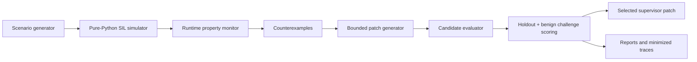

# Counterexample-Guided Repair for ADAS Supervisor State Machines

A SIL-first prototype that generates failed driving traces, proposes bounded supervisor repairs, and selects patches that improve dangerous holdout performance without overfiring in benign scenarios. The current v0.3 demo runs a deterministic pure-Python simulator over 483 scenarios, checks runtime properties, ranks candidate supervisor-state-machine patches, and exports reports, counterexamples, and fake-safety examples.

**This demo validates the repair loop, not vehicle safety.** It is not CARLA, not production ADAS validation, and not evidence of physical controller feasibility.

## Quickstart

```bash
python3 -m pytest
make demo
```

`make demo` regenerates scenarios, traces, candidate patches, verification outputs, and the latest report under `reports/latest/`.

## Current Demo Result

| Item | Result |
| --- | --- |
| Scenario suite | 483 total: 324 dangerous train, 81 dangerous holdout, 78 benign challenge |
| Selected patch | `candidate_architectural_combo` |
| Patch explanation | FOLLOWING split, confidence hysteresis, relative/cut-in TTC guard, and recovery constraints |
| Dangerous holdout improvement | 27.61% |
| Benign intervention rate | 0.00% |
| Invariant checks | Passes formal-tool-compatible invariant checks |

## Architecture



## What the Demo Does

- Generates dangerous train, dangerous holdout, and benign challenge scenario families.
- Runs a deterministic pure-Python simulator without requiring CARLA.
- Checks runtime properties for collision, critical TTC response, sensor degradation response, oscillation, and fake-safety behavior.
- Proposes bounded supervisor-state-machine repairs.
- Evaluates candidates on dangerous holdout and benign challenge scenarios.
- Selects a patch that balances dangerous-scenario improvement against benign-context overconservatism.
- Exports a Markdown report, JSON summary, before/after metrics, Pareto table, best patch YAML, minimized dangerous counterexamples, and rejected fake-safety examples.

## What It Does Not Do

- It does not validate vehicle safety.
- It does not model production vehicle dynamics, actuation limits, perception stacks, or controller feasibility.
- It does not require CARLA, RTAMT, or nuXmv as dependencies.
- It does not claim the selected patch is deployable in a real ADAS stack.
- It does not prove all unsafe cases are repaired; some dangerous collisions persist because the toy low-level braking model cannot avoid all severe cut-ins.

## Why the Selected Patch Won

`candidate_architectural_combo` is not the most aggressive dangerous-scenario patch. It won because it kept the benign intervention rate at 0.00% while still delivering a 27.61% dangerous holdout improvement and passing the formal-tool-compatible invariant checks.

More aggressive candidates reduce some dangerous scores but overfire in benign contexts:

| Candidate | Dangerous Holdout Total | Benign Intervention Rate | Why Rejected |
| --- | ---: | ---: | --- |
| `candidate_ttc_2_5` | 52928 | 69.23% | Enters intervention states in benign close-following cases |
| `candidate_full_mvp_repair` | 56802 | 69.23% | Improves dangerous cases but causes high benign intervention rate |
| `candidate_combined_ttc_sensor` | 64939 | 76.92% | Combines dangerous-case changes with the highest benign overfire rate |
| `candidate_architectural_combo` | 54227 | 0.00% | Selected: meaningful holdout gain without benign interventions |


One rejected fake-safety example:

- CSV: [candidate_ttc_2_5 benign close-following false positive](reports/latest/rejected_candidate_false_positives/candidate_ttc_2_5_1_candidate_ttc_2_5__benign_close_following_0000.csv)
- Trace plot: [candidate_ttc_2_5 rejected trace plot](reports/latest/trace_plots/rejected_candidate_ttc_2_5_1_candidate_ttc_2_5__benign_close_following_0000.svg)

## Report Artifacts

- [Latest report](reports/latest/index.md)
- [Summary JSON](reports/latest/summary.json)
- [Before/after metrics](reports/latest/before_after.csv)
- [Pareto table](reports/latest/pareto.csv)
- [Best patch YAML](reports/latest/best_patch.yaml)
- [Rejected candidate false positives](reports/latest/rejected_candidate_false_positives/)
- [Candidate tradeoff chart](reports/latest/figures/candidate_tradeoff.svg)

## Docs

- [Demo walkthrough](docs/demo_walkthrough.md)
- [Technical thesis](docs/technical_thesis.md)
- [Limitations](docs/limitations.md)

## Limitations

This is a deterministic SIL-first toy simulator. It is useful for validating the mechanics of counterexample-guided supervisor repair selection, but it is not a physical controller feasibility study, a CARLA validation run, a complete formal proof, or a production safety case. Utility and safety scores are proxy metrics for ranking bounded repair candidates in this prototype.
