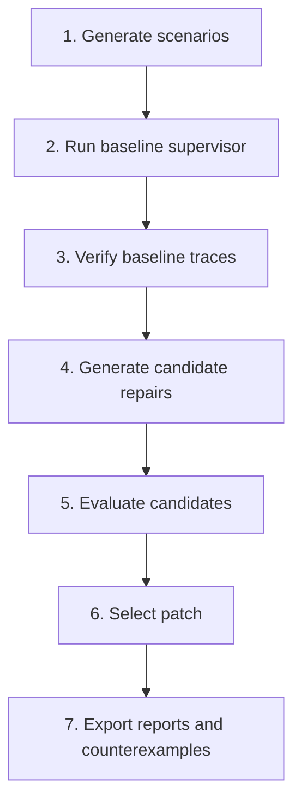

# Demo Walkthrough

This walkthrough explains the v0.3 end-to-end demo for the autonomy-supervisor-repair prototype. The demo validates a counterexample-guided supervisor repair loop, not vehicle safety.

## Run the Demo

```bash
make demo
```

The command regenerates the complete local artifact set under `data/`, `reports/baseline/`, and `reports/latest/`.

## Pipeline



## Step by Step

1. Generate scenarios.

   The scenario generator creates 483 deterministic SIL scenarios: 324 dangerous train scenarios, 81 dangerous holdout scenarios, and 78 benign challenge scenarios.

2. Run baseline.

   The baseline supervisor is simulated with the pure-Python backend. The first version intentionally does not require CARLA.

3. Verify traces.

   Runtime monitors check properties for collision, critical TTC response, sensor degradation handling, oscillation, and fake-safety behavior.

4. Generate candidate repairs.

   The repair step proposes bounded state-machine mutations. The current candidate set includes a FOLLOWING state split, confidence hysteresis, relative-velocity and cut-in TTC guards, and recovery constraints.

5. Evaluate candidates.

   Candidates are evaluated on dangerous train, dangerous holdout, and benign challenge splits. The important v0.3 challenge is avoiding fake safety: a patch should not win merely by braking earlier, entering MRM too often, or requesting takeover in benign contexts.

6. Select patch.

   The selected patch is `candidate_architectural_combo`. It combines FOLLOWING split, confidence hysteresis, relative/cut-in TTC guard, and recovery constraints. It improves dangerous holdout performance by 27.61%, has a 0.00% benign intervention rate, and passes formal-tool-compatible invariant checks.

7. Export report and counterexamples.

   The report includes before/after scoring, Pareto ranking, minimized dangerous counterexamples, selected-patch benign false-positive examples, and rejected candidate fake-safety examples.

## Why Overconservative Patches Are Rejected

The selection criterion includes dangerous holdout performance and benign challenge penalties. That prevents a patch from winning solely by entering safety interventions earlier or more often.

| Candidate | Benign Intervention Rate | Interpretation |
| --- | ---: | --- |
| `candidate_architectural_combo` | 0.00% | Selected: improves dangerous holdout without benign interventions |
| `candidate_ttc_2_5` | 69.23% | More aggressive TTC threshold overfires in benign close-following cases |
| `candidate_full_mvp_repair` | 69.23% | Broad repair improves some dangerous cases but overfires in benign contexts |
| `candidate_combined_ttc_sensor` | 76.92% | Combined TTC/sensor changes create the highest benign intervention rate |

See the candidate tradeoff chart: [reports/latest/figures/candidate_tradeoff.svg](../reports/latest/figures/candidate_tradeoff.svg).

## Rejected Fake-Safety Trace

One concrete rejected example is `candidate_ttc_2_5` entering `MIN_RISK_MANEUVER` during benign close-following:

- [CSV window](../reports/latest/rejected_candidate_false_positives/candidate_ttc_2_5_1_candidate_ttc_2_5__benign_close_following_0000.csv)
- [Trace plot](../reports/latest/trace_plots/rejected_candidate_ttc_2_5_1_candidate_ttc_2_5__benign_close_following_0000.svg)

## Primary Outputs

- [Latest report](../reports/latest/index.md)
- [Summary JSON](../reports/latest/summary.json)
- [Before/after metrics](../reports/latest/before_after.csv)
- [Pareto table](../reports/latest/pareto.csv)
- [Best patch YAML](../reports/latest/best_patch.yaml)
- [Rejected candidate false positives](../reports/latest/rejected_candidate_false_positives/)

## Read the Result Carefully

Some dangerous collisions persist even after MRM because the toy low-level braking model cannot avoid all severe cut-ins. The result says the repair loop can rank bounded supervisor patches against dangerous and benign scenarios. It does not say the selected patch is safe for a real vehicle.
